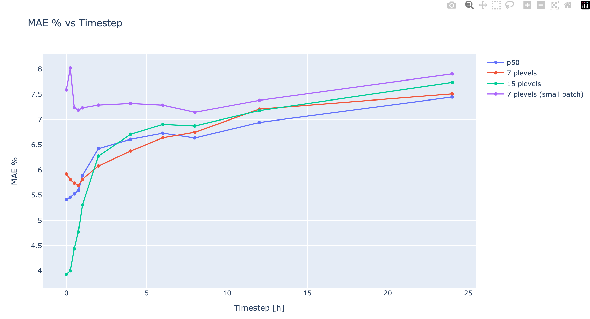

# Running WindNet for RUVNL for diferent Plevels

https://wandb.ai/openclimatefix/india/runs/5llq8iw6 is the current production one
This has 7 plevels and a small patch size. 

## Experiments

1. Only used plevel 50 (orange)
https://wandb.ai/openclimatefix/india/runs/ziudzweq/

2. Use plevels of [2, 10, 25, 50, 75, 90, 98]. This is what is already used. (green)
https://wandb.ai/openclimatefix/india/runs/xdlew7ib

3. Use plevels of [1, 02, 10, 20, 25, 30, 40, 50, 60, 70, 75, 80 (brown)
, 90, 98, 99]
https://wandb.ai/openclimatefix/india/runs/pcr2zsrc

## Training

Each epoch took about ~4 hours, so the training runs took several days.

TODO add number of samples

## Results

MAE results show that using the plevel of 50 only, gives better results

The p50 results are about the same

We can see that for p10 the results are not right, as they should converge to 0.1

Interestingly the more plevels you have the better the results are for before 4 hours
but the less plevels you have the better the results for >= 8 hours.

| Timestep | P50 only MAE % | 7 plevels MAE % | 15 plevel MAE %  | 7 plevels small patch MAE % |
| --- | --- | --- |  --- | --- |
| 0-0 minutes | 5.416 | 5.920 | 3.933 | 7.586 |
| 15-15 minutes | 5.458 | 5.809 | 4.003 | 8.021 |
| 30-45 minutes | 5.525 | 5.742 | 4.442 | 7.233 |
| 45-60 minutes | 5.595 | 5.698 | 4.772 | 7.187 |
| 60-120 minutes | 5.890 | 5.816 | 5.307 | 7.231 |
| 120-240 minutes | 6.423 | 6.080 | 6.275 | 7.287 |
| 240-360 minutes | 6.608 | 6.375 | 6.707 | 7.319 |
| 360-480 minutes | 6.728 | 6.638 | 6.904 | 7.285 |
| 480-720 minutes | 6.634 | 6.747 | 6.872 | 7.143 |
| 720-1440 minutes | 6.940 | 7.207 | 7.176 | 7.380 |
| 1440-2880 minutes | 7.446 | 7.507 | 7.735 | 7.904 |

