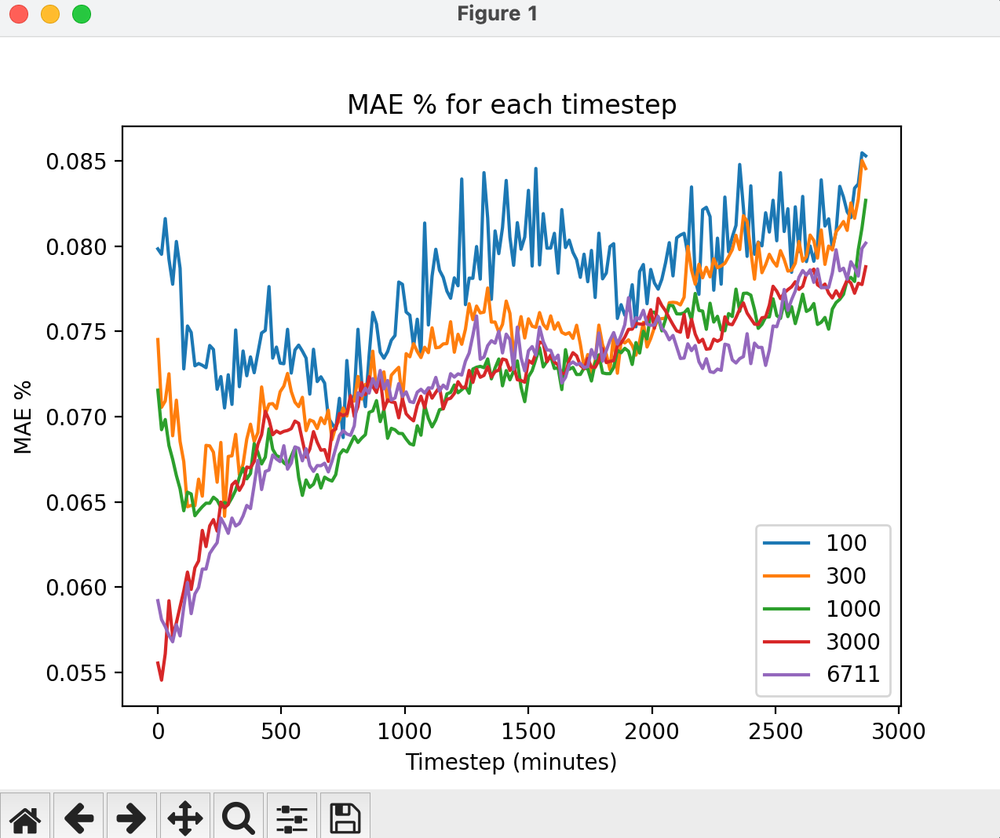
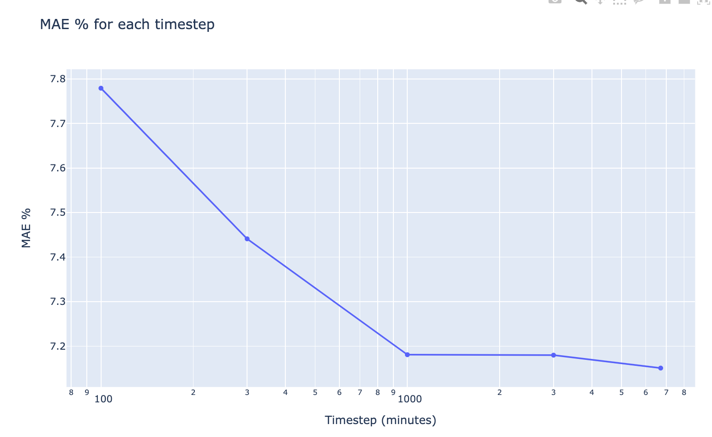

# N samples experiments

Kicked off an experiment that uses N samples
This is done by adding `limit_train_batches` to the `trainer/default.yaml`.

I checked that when limiting the batches, the same batches are shown to model for each epoch.

## Experiments

Original is 6711 batches

- 100: 3p6scx2r
- 300: am46tno1
- 1000: u04xlb6p
- 3000: p11lhreo

## Results

Overall

| Experiment | MAE % |
|------------|-------|
| 100        | 7.779 |
| 300        | 7.441 |
| 1000       | 7.181 |
| 3000       | 7.180 |
| 6711       | 7.151 |

Results by timestamps

| Timestep | 100 MAE % | 300 MAE % | 1000 MAE % | 3000 MAE % | 6711 MAE % |
| --- | --- | --- | --- | --- | --- |
| 0-0 minutes | 7.985 | 7.453 | 7.155 | 5.553 | 5.920 |
| 15-15 minutes | 7.953 | 7.055 | 6.923 | 5.453 | 5.809 |
| 30-45 minutes | 8.043 | 7.172 | 6.907 | 5.764 | 5.742 |
| 45-60 minutes | 7.850 | 7.070 | 6.790 | 5.815 | 5.698 |
| 60-120 minutes | 7.698 | 6.809 | 6.597 | 5.890 | 5.816 |
| 120-240 minutes | 7.355 | 6.629 | 6.495 | 6.221 | 6.080 |
| 240-360 minutes | 7.230 | 6.729 | 6.559 | 6.541 | 6.375 |
| 360-480 minutes | 7.415 | 6.997 | 6.770 | 6.855 | 6.638 |
| 480-720 minutes | 7.258 | 7.037 | 6.668 | 6.876 | 6.747 |
| 720-1440 minutes | 7.659 | 7.362 | 7.038 | 7.142 | 7.207 |
| 1440-2880 minutes | 8.027 | 7.745 | 7.518 | 7.535 | 7.507 |

