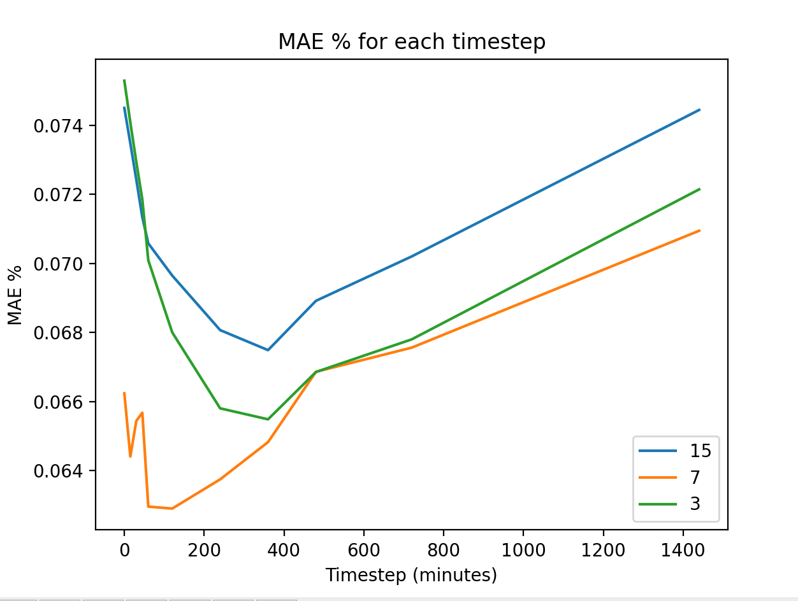
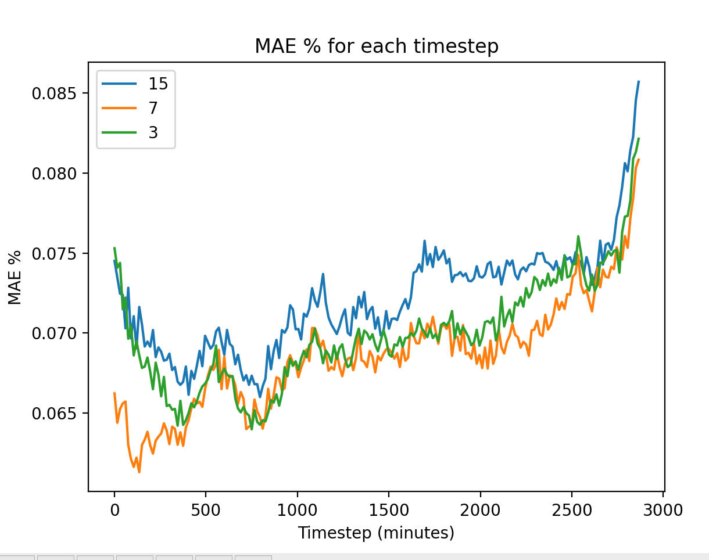

# Adding extra nwp variables

I wanted to run Windnet but testing some new nwp variables from ecmwf

## Bugs

Ran into a problem where found that some xamples have
`d.__getitem__('nwp-ecmwf__init_time_utc').values` had size 50, where it should be just one values. I removed these examples. This might 

## Experiments

The number of samples were ....

### 15 variablles
Run windnet with `'hcc', 'lcc', 'mcc', 'prate', 'sde', 'sr', 't2m', 'tcc', 'u10',
       'v10', 'u100', 'v100', 'u200', 'v200', 'dlwrf', 'dswrf'`.

The experiment on wandb is [here](https://wandb.ai/openclimatefix/india/runs/k91rdffo)

### 7 variables
Run windnet with the original 7 variables.
`t2m, u10, u100, u200, v10, v100, v200  `

The experiment on wandb is [here](https://wandb.ai/openclimatefix/india/runs/miszfep5)

### 3 variables
Run windnet with only `t, u10, v100`

The experiment on wandb is [here](https://wandb.ai/openclimatefix/india/runs/22v3a39g)

## Results

| Timestep | 15 MAE % | 7 MAE % | 3 MAE % |
| --- | --- | --- | --- |
| 0-0 minutes | 7.450 | 6.623 | 7.529 |
| 15-15 minutes | 7.348 | 6.441 | 7.408 |
| 30-45 minutes | 7.242 | 6.544 | 7.294 |
| 45-60 minutes | 7.134 | 6.567 | 7.185 |
| 60-120 minutes | 7.058 | 6.295 | 7.009 |
| 120-240 minutes | 6.965 | 6.290 | 6.800 |
| 240-360 minutes | 6.807 | 6.374 | 6.580 |
| 360-480 minutes | 6.749 | 6.482 | 6.548 |
| 480-720 minutes | 6.892 | 6.686 | 6.685 |
| 720-1440 minutes | 7.020 | 6.756 | 6.780 |
| 1440-2880 minutes | 7.445 | 7.095 | 7.214 |

The raw data is here

