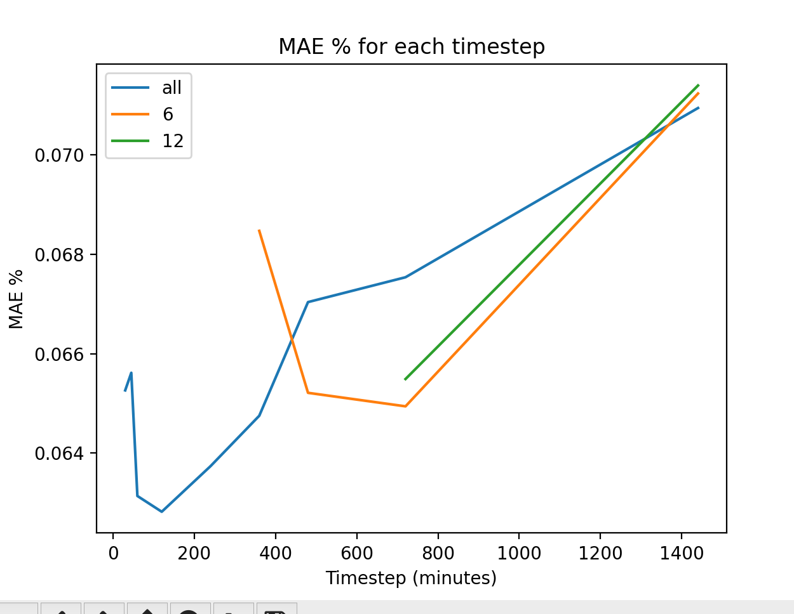

## DA forecasts only

The idea was to create a forecast for DA (day-ahead) only for Windnet.
We hope this would bring down the DA MAE values.

We do this by not forecasting the first X hours. 

Unfortunately, it doesnt not look like ignore X hours, make the DA forecast better. 

## Experiments

1. Baseline - [here](https://wandb.ai/openclimatefix/india/runs/miszfep5)
2. Ignore first 6 hours - [here](https://wandb.ai/openclimatefix/india/runs/uosk0qug)
3. Ignore first 12 hours - [here](https://wandb.ai/openclimatefix/india/runs/s9cnn4ei)

## Results

| Timestep | all MAE % | 6 MAE % | 12 MAE % |
| --- | --- |---------|---------|
| 0-0 minutes | nan | nan     | nan     |
| 15-15 minutes | nan | nan     | nan     |
| 30-45 minutes | 0.065 | nan     | nan     |
| 45-60 minutes | 0.066 | nan     | nan     |
| 60-120 minutes | 0.063 | nan     | nan     |
| 120-240 minutes | 0.063 | nan     | nan     |
| 240-360 minutes | 0.064 | nan     | nan     |
| 360-480 minutes | 0.065 | 0.068   | nan     |
| 480-720 minutes | 0.067 | 0.065   | nan     |
| 720-1440 minutes | 0.068 | 0.065   | 0.065   |
| 1440-2880 minutes | 0.071 | 0.071   | 0.071   |

