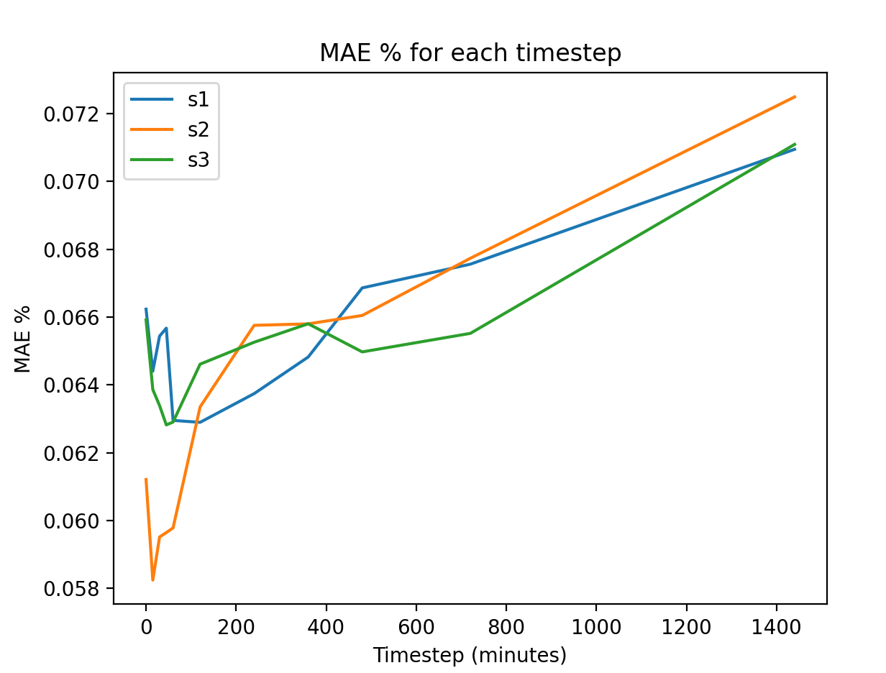
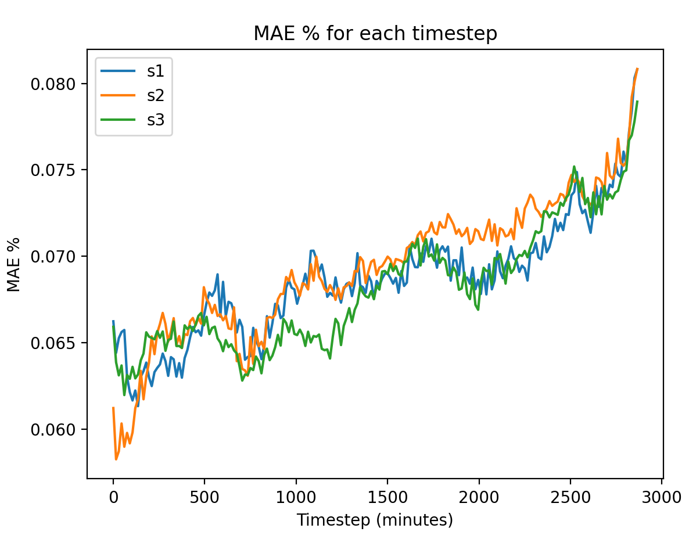

# Training models with different seeds

Want to see the effect or training a model with different seeds.

We can see that the results for different seeds can vary by 0.5%, 
and some models being better at different time horizons than others

## Experiments
- seed 1 - [miszfep5](https://wandb.ai/openclimatefix/india/runs/miszfep5) 
- seed 2 - [cxshv2q4](https://wandb.ai/openclimatefix/india/runs/cxshv2q4)
- seed 3 - [m46wdrr7](https://wandb.ai/openclimatefix/india/runs/m46wdrr7)

These were trained with 1000 batches, and 300 batches for validation

## Results

| Timestep | s1 MAE % | s2 MAE % | s3 MAE % |
| --- | --- | --- | --- |
| 0-0 minutes | 0.066 | 0.061 | 0.066 |
| 15-15 minutes | 0.064 | 0.058 | 0.064 |
| 30-45 minutes | 0.065 | 0.060 | 0.063 |
| 45-60 minutes | 0.066 | 0.060 | 0.063 |
| 60-120 minutes | 0.063 | 0.060 | 0.063 |
| 120-240 minutes | 0.063 | 0.063 | 0.065 |
| 240-360 minutes | 0.064 | 0.066 | 0.065 |
| 360-480 minutes | 0.065 | 0.066 | 0.066 |
| 480-720 minutes | 0.067 | 0.066 | 0.065 |
| 720-1440 minutes | 0.068 | 0.068 | 0.066 |
| 1440-2880 minutes | 0.071 | 0.072 | 0.071 |

