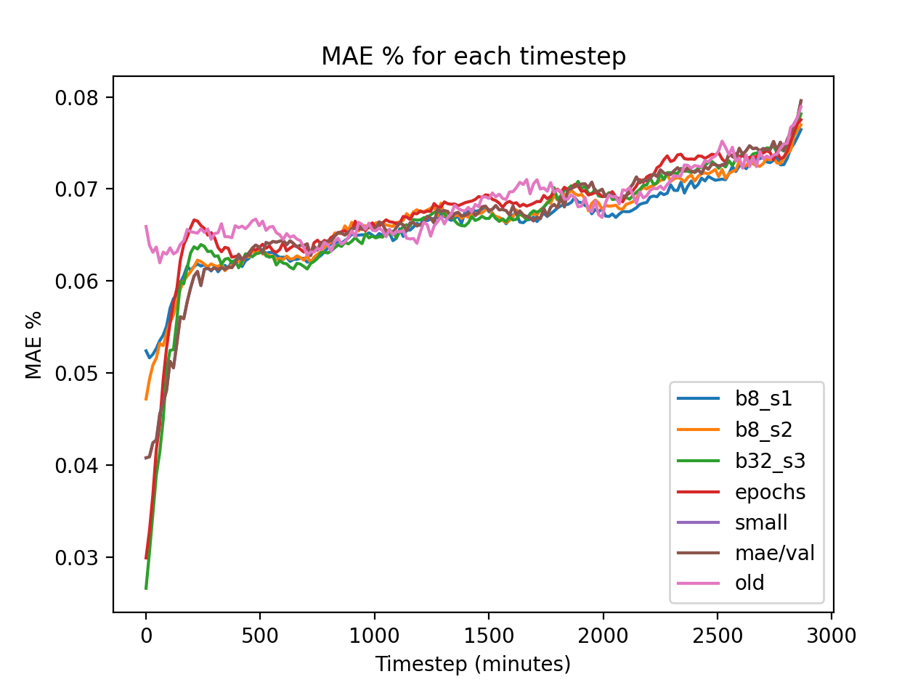
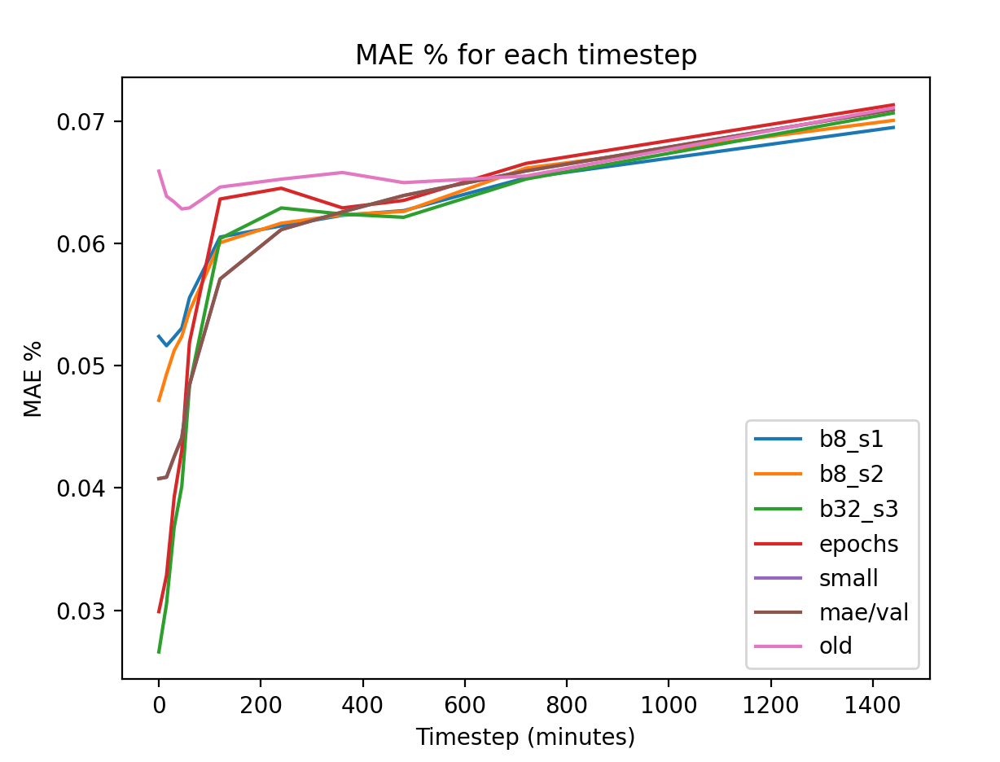

# Coarser data and more examples

We down samples the ECMWF data from 0.05 to 0.2.
In previous experiments we used a 0.1 resolution, as this is the same as the live ECMWF data.

By reducing the resolution we can increase the number of samples we have to train on.
We used 41408 number of samples to train, and 10352 samples to validate
This is approximately 5 times more samples than the previous experiments.

## Experiments

### b8_s1
Batche size 8, with 0.2 degree NWP data.
https://wandb.ai/openclimatefix/india/runs/w85hftb6

### b8_s2
Batch size 8, different seed, with 0.2 degree NWP data.
https://wandb.ai/openclimatefix/india/runs/k4x1tunj

### b32_s3
Batch size 32, with 0.2 degree NWP data. Also kept the learning rate a bit higher
https://wandb.ai/openclimatefix/india/runs/ktale7pa

### old
Old experiment with 0.1 degree NWP data.
https://wandb.ai/openclimatefix/india/runs/m46wdrr7.
Note the validation batches are different that the experiments above.

Interesting the GPU memory did not increase much better experiments 2 and 3.
Need to check that 32 batches were being passed through.

## Results

The coarsening data does seem to improve the experiments results in the first 10 hours of the forecast.
DA forecast looks very similar.

Still spike results in the individual runs

| Timestep | b8_s1 MAE % | b8_s2 MAE % | b32_s3 MAE % | old MAE % |
| --- | --- | --- | --- | --- |
| 0-0 minutes | 0.052 | 0.047 | 0.027 | 0.066 |
| 15-15 minutes | 0.052 | 0.049 | 0.031 | 0.064 |
| 30-45 minutes | 0.052 | 0.051 | 0.037 | 0.063 |
| 45-60 minutes | 0.053 | 0.052 | 0.040 | 0.063 |
| 60-120 minutes | 0.056 | 0.054 | 0.048 | 0.063 |
| 120-240 minutes | 0.061 | 0.060 | 0.060 | 0.065 |
| 240-360 minutes | 0.061 | 0.062 | 0.063 | 0.065 |
| 360-480 minutes | 0.062 | 0.062 | 0.062 | 0.066 |
| 480-720 minutes | 0.063 | 0.063 | 0.062 | 0.065 |
| 720-1440 minutes | 0.065 | 0.066 | 0.065 | 0.066 |
| 1440-2880 minutes | 0.069 | 0.070 | 0.071 | 0.071 |

