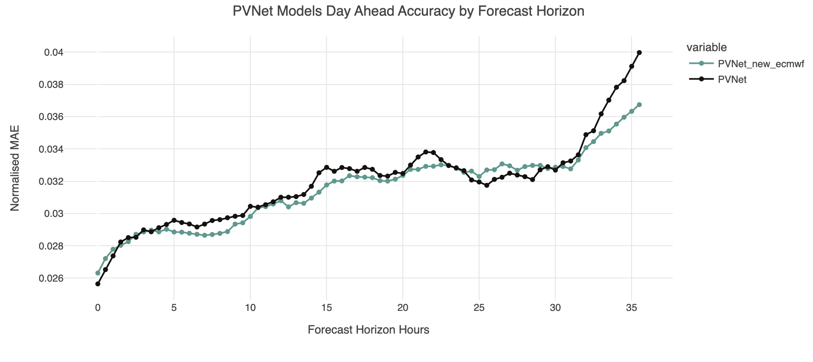

PVNet day ahead was retrained to produce a 36 hour forecast, it was given its [previous configuration](https://huggingface.co/openclimatefix/pvnet_uk_region/tree/main) and data except for being given ECMWF NWP data with a longer forecast horizon (max 85 hours but 37 hours given to the model). Longer horizon UKV NWP data was not available at time of training and will be a further addition in the future.  

**Results** \
[The training run](https://wandb.ai/openclimatefix/pvnet_day_ahead_36_hours/runs/m4d3wlft/overview) had 3.15% normalised mean absolute error (NMAE) on validation data (100,000 samples from May 2022 to May 2023), [previous training of PVNet day ahead](https://wandb.ai/openclimatefix/pvnet2.1/runs/2ghzwbxg/overview?) had similar results of 3.19% NMAE. 

When comparing the two versions of PVNet day ahead (the new version in green) by forecast accuracy at each step on the validation dataset samples we see some small differences in the model up to 33 hours, such as first the first few steps and between steps 5 and 10, which could be explained by differences in samples seen and evaluated on between the two versions. 

However the larger difference is an improvement toward the end of the forecast horizon, from 33 hours onwards which is likely due to ECMWF data now being available for this period, when previously no NWP data was given past 33 hours due to the NWP forecast horizon of previous data and factoring in NWP initialization times and production delays. 

UKV NWP data used in the model is currently up to 30 hours, we would expect a further reduction in error from 30+ hours when training with longer horizon UKV data which would cover up to 36 hours. 

A very rough comparison is also plotted between these two PVNet model versions and the National XG model which is currently used for day ahead predictions in production. 

  

This comparison is rough and should not be seen as a fair comparison as the national XG numbers are just an estimate derived from backtest data on different time periods. However, it can show roughly what relative improvement could be achieved from replacing the National XG Day ahead model with a PVNet Day Ahead model. 

