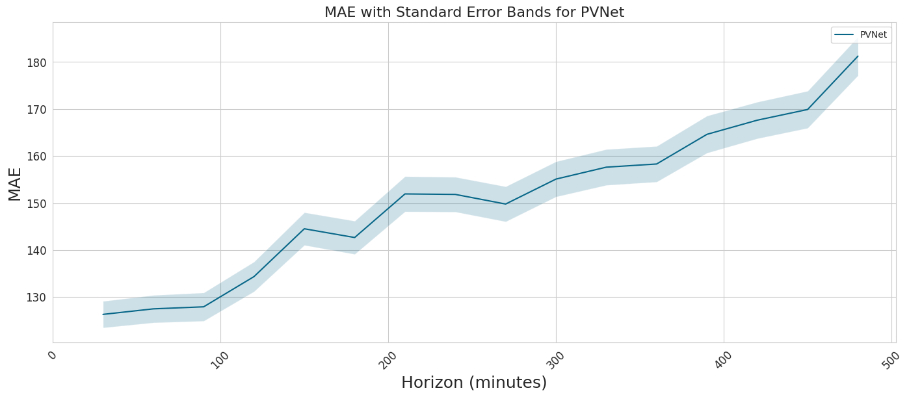

# OCFs PVNet Forecast Evaluation

This report compares the accuracy of OCF’s national PV forecast (PVNet) and Sheffield Solar PVLive Intraday forecast, using the updated PVLive as the benchmark as well as additional analtysis on PVNets overall performance.

## Table of Contents

1. [Introduction](#introduction)
2. [Data Overview](#data-overview)
3. [PVLive Intraday and PVNet vs PVLive Updated](#pvlive-intraday-and-pvnet-vs-pvlive-updated)
   * [Results Table](#results-table)
   * [Mean Absolute Error](#mean-absolute-error)
   * [Mean Bias Error](#mean-bias-error)
   * [Error Distribution](#error-distribution)
4. [PVNet Model Evaluation](#pvnet-model-evaluation)
   * [PVNet Results Table](#pvnet-results-table)
   * [Mean Absolute Error](#mean-absolute-error-1)
   * [Mean Bias Error](#mean-bias-error-1)
5. [Conclusion](#conclusion)
6. [Appendix](#appendix)

## Introduction

In this report, we evaluate the performance of OCFs national PV forecast (PVNet) against the Shefield Solar PVLive Intraday forecast, using the updated PVLive forecast as the benchmark truth for this comparison. This report will look into various error metrics and discuss the implications of our findings. First we will compare how PVLive Intraday and PVNet perform against PVLive Updated over periods in which we have data for. Then a more comprehensive evaluation of PVNet vs PVLive Updated is completed across the year of 2022, including evaluating the performance across different forecast horizons.

This report should be used to indicate the difference in the forecasting capaboilities between the two as well as provide a framework for future analysis to completed over an larger number of data points.

---

## Data Overview

The aim of these results is to evaluate the performance of the OCF PVNet model against the PVLive Intraday forecast over 2022. As PVLive Intraday is forecast with just a single horizon (at t=0 (now)), an equivlent horizon has been extracted from the PVNet forecast to make it a fair comparison.

The number of datapoints that can be used to compare is restricted by two factors. Firstly, OCF started recording the data from PVLive intraday around halfway through 2022 (on 2022-06-14). Hence for the time preceeding this period we do not currently have the data available to compare against PVNet. Secondly, when creating the PVNet backtest there was some missing data, in paricular:

* ~1 month of missing NWP data
* ~1 month of missing satelitte data
* 2 days every month in which the statelittes switch over.

This missing data would not occur in a production environment and ultimately would misreprsent the performance of the model. Hence these forecasts have been ommited from the comparison. The quantities of data available can be seen in the chart below (fig 1) where the y axis represents the date, with the top indicating the start of 2022 and the bottom indicating the end of 2022 and the x axis labelling the different data used. The darkend areas illustrates data that is available where as the white areas show missing or ommitted data.

*Fig 1: The data availability across the 3 datasets used in this analysis.*

This report will first look into just the overlapping datapoints from PVLive Intraday and PVNet as shown in the graph above before then moving on to compare all of the datapoints available for PVNet and PVLive updated.

---

## PVLive Intraday and PVNet vs PVLive Updated

### Results Table

| Forecast | MAE                     | RMSE                   | MBE              | R2
|----------|-------------------------|------------------------|------------------|-------
| PVLive Intraday | 197.37 ± 4.19    | 357.56 ± 7.33          | -187.91 ± 4.28   | 0.978
| PVNet    | 129.75 ± 2.73           | 233.49 ± 5.21          | 6.30 ± 3.28      | 0.99

The ± represents the standard error in the metric.

PVNet has a statiscially significant MAE of 129.75 MW compared to PVLive Intradays MAE of 197.37 MW(shown to be statstically significant with a sample size of n = 5053). Across the data points tested PVNet has a 34.3% reduction in MAE compared to PVLive Intraday.

PVNet also shows a significant reduction in MBE compared to PVLive Intraday. PVLive intraday has an MBE of -187.91 MW indicating a strong tendency to underpredict the actual value where as PVNet has an MBE of 6.30 MW indicating a very slight tendency to overpredict.

### Standard Deviations of Metrics

| Forecast | Std MAE        | StdRMSE       | Std MBE     |
|----------|----------------|---------------|-------------|
| PVLive Intraday    | 298.17         | 521.04        | 304.23      |
| PVNet    | 194.14         | 370.62        | 233.43      |

Across all metrics, PVNet has lower standard deviations compared to PVLive Intraday, sugesting that PVNets errors are more concentrated around the mean and as such are more reliable.

### Mean Absolute Error (MAE)

*Fig 2: Average monthly MAE (MW) for PVNet and PVLive Intraday*

Errors are larger in the summer months for both forecasts due to increased solar radiation which inturn leads to greater differenced between the forecasted and actual values. This error generally decreases as the years goes into the winter months. PVNet shows a significant improvement in MAE, espcially over June and July. This difference decreases before then a similar performance in MAE is observed in November.

The following heatmaps will break this down to show how the average MAE per hour varys across the day, firstly broken down months and then weeks. A heatmap is used to show the errors, with light red showing a low MAE for that period and a darker red showing a hgih MAE for that period. The weeks in which there is no data available have been removed, as such the week number, shown in the y axis, may skip a week or two at points.

<table>
<tr>
<td></td>
<td></td>
</tr>
<tr>
<td>Fig 3: PVLive Intraday MAE heatmap for Hour vs Month.</td>
<td>Fig 4: PVNet MAE heatmap for Hour vs Month.</td>
</tr>
</table>

<table>
<tr>
<td></td>
<td></td>
</tr>
<tr>
<td>Fig 5: PVLive Intraday MAE heatmap for Hour vs Week.</td>
<td>Fig 6: PVNet MAE heatmap for Hour vs Week.</td>
</tr>
</table>

From the heatmaps we can see that most of the worst errors of PVLive intraday occur between 9-12am where as with PVNet they are more evenly distributed across all hours.

### Mean Bias Error

*Fig 7: Average monthly MBE for PVNet and PVLive Intraday*

Looking at the Mean Bias Error across the months, PVLive Intraday has strong tendency to unpredicted, with this bias strongest in the summer months. PVNet also has a slight tendency to unpredict in these summer months as well before switching to having a slight tendency to overpredict in the winter. As the year progresses towards the winter months PVLive Intradays bias does start to decrease where it reaches around -60 in Novemeber compared to PVNet which sits around +50.

Like before, the following heatmaps will break the MAE down into the average MAE per hour for months and weeks. With red showing an overprediction (the darker the red the greater the overprediction) and blue showing an underprediction (the darker the blue the greater the underprediction) for that period.

<table>
<tr>
<td></td>
<td></td>
</tr>
<tr>
<td>Fig 8: PVLive Intraday MBE heatmap for Hour vs Month.</td>
<td>Fig 9: PVNet MBE heatmap for Hour vs Month.</td>
</tr>
</table>

<table>
<tr>
<td></td>
<td></td>
</tr>
<tr>
<td>Fig 10: PVLive Intraday MBE heatmap for Hour vs Week.</td>
<td>Fig 11: PVNet MBE heatmap for Hour vs Week.</td>
</tr>
</table>

The heatmaps shows that PVLive Intraday has a strong tendecy to underpredict with only 1 week having strong signs of an overprediction (week 35). PVNet illustrates and tendency to underpredict in the very early and later hours of the day (around sunrise and sunset) and slight tendency to overpredict in the middle of the day, but with some underpreictions occuring (primarily during week 30 to 34).

### Error Distribution

*Fig 12: Histrogram of error distribution of PVNet and PVLive Inraday, with nights removed.*

When viewing the error distrubtion, the effect of the mean bias in each of the forecasts becomes visible. With PVLive Intraday having a strong negative skew and PVNet having a symetrical distribution.

---

## PVNet Model Evaluation

Next this report will look at the performance of PVNet compared to PVLive updated across 2022. PVNet was evaluated against PVLive updated, where data was present for each, over the period of:

* 2022-01-01 to 2022-11-19

The results shown in the table below are from taking that 0th hour forecast (now), which is the same that was used for the PVLive Intraday comparison above, and comparing the results to PVLive Updated. This section also contains graphs which illustrate the performance of PVNet across its different forecasting horizons (0-8hours).

### PVNet Results Table

| Metric | PVNet ± Standard Erorr| Standard Deviation
|--------|-----------------------|-------------------
| MAE    | 126.92 ± 1.80         |200.40
| RMSE   | 237.20 ± 3.52         |392.69
| MBE    | 11.01 ± 2.12          |237.00
| R^2    | 0.990                 |

### Mean Absolute Error

*Fig 13: Average monthly MAE for PVNet across 2022.*

The MAE starts to increase from February to May where it then stablises over the summer before then decreasing from August right through to November.

*Fig 14: PVNet horizon vs MAE averaged across 2022.*

Over the 8 hours that PVNet makes predictions for, its MAE increases from 126 to around 180 which equates to an around 43% increase in error over the 8 hours.

<table>
<tr>
<td></td>
<td></td>
</tr>
<tr>
<td>Fig 15: PVNet MAE heatmap for Hour vs Month.</td>
<td>Fig 16: PVNet MAE heatmap for Hour vs Week.</td>
</tr>
</table>

### Mean Bias Error

*Fig 17: Average monthly MBE for PVNet across 2022.*

An almost inverse in pattern is seen between MAE and MBE with overpredictions happening in the autumn and winter months and underpredictions in spring and summer, peaking in August with an average MBE for that month around -40 MW.

*Fig 18: PVNet horizon vs MBE averaged across 2022.*

Reviewing how MBE changes across horizons show that past 6 hours (360 minutes), the negative MBE starts to increase.

<table>
<tr>
<td></td>
<td></td>
</tr>
<tr>
<td>Fig 19: PVNet MBE heatmap for Hour vs Month.</td>
<td>Fig 20: PVNet MBE heatmap for Hour vs Week.</td>
</tr>
</table>

The MBE heatmaps across the year confirm the earlier evaluation of a tendency to underpredict during sunrise and sunset hours.

---

## Conclusion

The report evaluates the performance of OCF’s national PV forecast (PVNet) against Sheffield Solar’s PVLive Intraday forecast, using PVLive Updated as the baseline for comparison, focusing on various error metrics across 2022. Due to limitations in data availability, the comparison initially considers overlapping data points for PVLive Intraday and PVNet before extending to all available data for PVNet and PVLive Updated.

PVNet outperforms PVLive Intraday, with a Mean Absolute Error (MAE) of 129.75 MW and a Mean Bias Error (MBE) of 6.30 MW, compared to PVLive Intraday’s MAE of 197.37 MW and MBE of -187.91 MW. This demonstrates statistically significant improvements and increased reliability from PVNet. Additionally, PVNet has greater consistency evident from its lower standard deviations in all metrics compared to PVLive Intraday, indicating that PVNet's errors are more tightly concentrated around the mean.

PVLive Intraday predominantly underpredicts, with a pronounced negative skew in error distribution and the bias peaking in the early summer months. In contrast, PVNet exhibits a symmetrical error distribution but with a tendency to underpredict around sunrise and sunset.

---

## Appendix

### Error Metrics

To compute the error metrics, we utilised the following mathematical formulas:

1. **MAE (Mean Absolute Error)**:
$$\text{MAE} = \frac{1}{n} \sum_{i=1}^{n} \left| y_{\text{true},i} - y_{\text{pred},i} \right|$$

2. **RMSE (Root Mean Squared Error)**:
$$\text{RMSE} = \sqrt{\frac{1}{n} \sum_{i=1}^{n} \left( y_{\text{true},i} - y_{\text{pred},i} \right)^2}$$

3. **R^2 (Coefficient of Determination)**:
$$R^2 = 1 - \frac{\sum_{i=1}^{n} \left( y_{\text{true},i} - y_{\text{pred},i} \right)^2}{\sum_{i=1}^{n} \left( y_{\text{true},i} - \bar{y_{\text{true}}} \right)^2}$$

Where $\bar{y_{\text{true}}}$ is the mean of the true values.

4. **MBE (Mean Bias Error)**:
$$\text{MBE} = \frac{1}{n} \sum_{i=1}^{n} \left( y_{\text{pred},i} - y_{\text{true},i} \right)$$

### Variability of Error Metrics

The **Standard Deviations** of these metrics are calculated as follows:
$$\sigma = \sqrt{\frac{1}{n} \sum_{i=1}^{n} \left( \text{Metric}_i - \bar{\text{Metric}} \right)^2}$$
Where $\bar{\text{Metric}}$ is the mean of the metric across all data points.

The **Standard Error of The Mean** of these metrics are calcuated as follows:
$$ SE = \frac{\sigma}{\sqrt{n}}$$

## Additional Graphs

The following graphs show results for the root-mean-square deviation (RMSE).

*Fig 21: Average monthly RMSE for PVNet and PVLive Intraday*

*Fig 22: Average monthly RMSE for PVNet across 2022.*

*Fig 23: PVNet horizon vs RMSE averaged across 2022.*

The following graph uses a Kernal density plot as another way to visualise the error distribution.

*Fig 24: Kernel density estimation of error distribution of PVNet and PVLive Inraday, with nights removed.*
